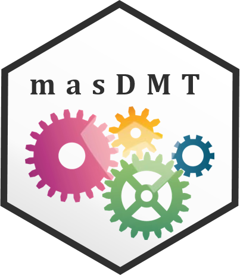

<!-- badges: start -->
[](https://www.tidyverse.org/lifecycle/#maturing)
<!-- badges: end -->

### Towards interoperable workflows

<p align="justify">
<a href="https://www.idiv.de/en/groups-and-people/core-groups/macroecosocial.html">The Macroecology & Society (MAS)</a> is a research group of the German Centre for Integrative Biodiversity Research (iDiv). It is composed by an interdisciplinary team of scientists, with backgrounds in geography, statistics, macro- and community ecology, environmental resource management, environmental social science, crop science, and agricultural biology. In this rich environment, we can confidently deal with large amounts of diverse data, from statistical surveys to global, gridded and vector layers. These data are frequently shared across projects, creating a need for a common knowledge infrastructure. With this in mind, we developed `masDMT`. This R package provides the members of the MAS lab with standardized access points their common database, as well as tools to make research projects scalable. It helps transfer a project between small, local analysis in a desktop, to global analysis in High Performance Computing (HPC) environment.
</p>

<br>

## Installation
<p align="justify">
`masDMT` can be installed with `devtools` using the following code snipet:
</p>

```r
devtools::install_github('macroecology-society/masDMT')
```

<br>

### Acknowledgements
<p align="justify">
This work was funded by the Volkswagen Foundation through a Freigeist Fellowship to <a href="https://orcid.org/0000-0003-3927-5856">Carsten Meyer <i class="fab fa-orcid"></i></a>, with additional support by iDiv (FZT-118, DFG). `masDMT` and the data infrastructure it serves were developed with the High-Performance Computing (HPC) Cluster EVE, a joint effort by the Helmholtz Centre for Environmental Research (UFZ) and the German Centre for Integrative Biodiversity Research (iDiv) Halle-Jena-Leipzig.
</p>

<p align="center">
<a href="https://www.idiv.de/en/groups-and-people/core-groups/macroecosocial.html"></a>&nbsp;&nbsp;&nbsp;&nbsp;&nbsp;&nbsp;&nbsp;&nbsp;&nbsp;&nbsp;&nbsp;<a href="https://www.volkswagenstiftung.de/en/funding/our-funding-portfolio-at-a-glance/freigeist-fellowships"></a>
</p>

<br>
