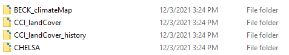
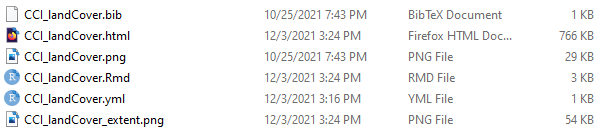

```{r, setup, include=FALSE, echo=FALSE}
knitr::opts_chunk$set(echo = TRUE)
require(masDMT)
```

### Documenting data
<p align='justify'>
This section describes how to document datasets and how to <a href="https://macroecology-society.github.io/data-catalog/">integrate them in the MAS data catalog.</a>. `masDMT` makes this registration easier, providing tools to automatically generate complex html records.
</p>
<p align='justify'>
When creating a descriptor for a new dataset, we should keep the catalog organization in mind, Let's peek under the hood. If we look at <a href="">where posts are stored</a>, we will see something like shown below. As you can see, each dataset has one folder with the its unique identifier. For example, the land cover dataset of the climate change initiative (CCI) is recorded as `CCI_landCover`, the same ID we can provide to `list_data` to find the path to the corresponding rasters (<a href="https://github.com/macroecology-society/masDMT/tree/master/docs/articles/find-data.html">see this article for examples on data access</a>).
</p>

<br>



<br>

<p align='justify'>
Keeping our focus on the `CCI_landCover` dataset, we can obtain further insights on which files a dataset contains. As shown below, this record contains the following files:
<ul>
<li>`Rmd`: needed by `Rmarkdown` create an `html`</li>
<li>`html`: Knited from the `Rmd` file, used by the website</li>
<li>`CCI_landCover.png`: Preview image of the dataset</li>
<li>`CCI_landCover_extent.png`: Image showing the spatial extent of the dataset</li>
<li>`CCI_landCover.bib`: Bibtex file with literature reference of dataset</li>
<li>`CCI_landCover.yml`: Configuration file with metadata of dataset</li>
</ul>
</p>

<br>



<br>

<p align='justify'>
Here, the most important thing is the `yaml` file. This is where we enter metadata required by the catalog, which will be used when automatically generating the `Rmd`, `html`, and extent image files. The preview image and the bibtex are optional. Images are expected to have a size of 200x100 pixels. If you don't feel like cropping images through scripting, <a href="https://resizeimage.net/">I recommend this website</a>.
</p>

<br>

### Creating a new metadata record 
<p align='justify'>
As a practical example, let's create a new metadata record for a hypothetical dataset called `land cover`. First we use `build_descriptor()` to setup the data descriptor, creating a file structure we can later feed to the data catalog. We will give this dataset the unique identifier `land_cover`, and provide a bibtex with its literature references and a preview image.
</p>

<br>

```{r eval=FALSE}
# specify arguments
path = '/metadata/' # path to directory where to create metadata record
id = 'land_cover' # uique dataset identifier
bib = '/data/bibtex.bib' # path to bibtex
img = '/data/preview.bib' # path to preview image

# run function to build dataset repository
build_descriptor(path, id, bibtex=bib, preview=img)

```

<br>

<p align='justify'>
As seen below, the output consists of a folder names `land_cover`, containing several files with the same name. This includes the bibtex and preview image we provided, together with a yaml file.
</p>

<br>

```{yaml eval=FALSE}
subdatasets:
 continuous_raster:
  variable: Continuous raster dataset
  content:
   value_range: 1...10 (scale factor 0.01)
```

<br>

### Documenting metadata

<p align='justify'>
The yaml is copied from within `masDMT`, and specifies all fields that need completion. The table below lists those fields and provides their description. Notice that some fields have predefined keywords that must be followed.
</p>

<br>

|      field        | description                                                                                |
|-------------------|--------------------------------------------------------------------------------------------|
|title              | Unique identifier                                                                          |
|short_description  | Short dataset description, used in preview and included in the extended metadata record    |
|long_description   | Long dataset description, used only in the extended metadata record                        |
|documentation      | Link to documentation file, or e-mail of whom to reach                                     |
|data_access        | link of where to access the data from, or e-mail of whom to reach                          |
|license            | Dataset license                                                                            |
|categories         | Keyword specifying the topic of the dataset, which is used to refine the search for records|
|status             | Status of the dataset (one of `available`, `developing`, or `planned`)                     |
|format             | Format of the dataset (one of `Grid`, `Vector`, or `Table`)                                |
|spatial_resolution | Spatial resolution, expressed as a mixture of a numeric element and a character (e.g. 30m) |
|temporal_resolution|Temporal resolution of dataset (e.g. yearly, multiyear snapshot)                            |
|temporal_range     | Start and end of the period covered by the dataset, expressed as dates (yyyy-mm-dd)        |
|spatial_extent     | Bounding coordinates of the dataset (min x, max x, min y, max y)                           |
|subdatasets        | List and description of subdatsets                                                         |

<br>

<p align='justify'>
The `subdatset` field extends further, with one entry for each subdataset. Below we have three examples on how to fill the `subdataset` section. Note that every subdataset requires a `variable` description, but additional metadata depends on the nature of the input dataset.
</p>

<br>

#### Example A: Continuous raster
<p align='justify'>
As shown in the example below, all continuous raster datasets demand is information on its minimum and maximum values. This requires us to add a `value_range` field, which we can describe with the minimum and maximum values, providing a scaling factor in parenthesis when applicable.
</p>

```{yaml eval=FALSE}
subdatasets:
 continuous_raster:
  variable: continuous raster dataset
  content:
   value_range: 1...10 (scale factor 0.01)
```

<br>

#### Example B: Categorical raster
<p align='justify'>
Categorical raster datasets require some documentation effort. Here, we need to provide a field for each raster value, describing it with the adequate class.
</p>

```{yaml eval=FALSE}
subdatasets:
 categorical_raster:
  variable: categorical raster dataset
  content:
   1: agriculture
   2: forest
   3: water
```

<br>

#### Example C: Vector/Table
<p align='justify'>
Vector and tabular datasets impose a similar challenge as categorical rasters. Here, we need to provide each column as a field, and accopany that field with an adequate description.

```{yaml eval=FALSE}
subdatasets:
 vector_or_table:
  variable: tabular dataset
  content:
   column_1: description of column 1
   column_2: description of column 2
```

<br>

<p align='justify'>
The examples above demonstrate the documentation of individual subdatasets. However, we can add more than one by following the example below.
</p>

```{yaml eval=FALSE}
subdatasets:
 vector_dataset_1:
  variable: tabular dataset
  content:
   column_1: description of column 1
   column_2: description of column 2
 vector_dataset_2:
  variable: tabular dataset
  content:
   column_1: description of column 1
   column_2: description of column 2
```

<br>

### Knitting documentation
<p align='justify'>
Before we can add our metadata record into the data catalog, we first need to knit it into an html. To assure the standardization of metadata records, we can se `knit_descriptor()`. This function reads the yaml file we previously documented, and translates it into a fully formated `Rmarkdown` file, which is then translated into `html`.
</p>

```{r eval=FALSE}
# use "path" and "id", specified when calling build_descriptor()
knit_descriptor(file.path(path, paste0(id, '.yml')))
```
